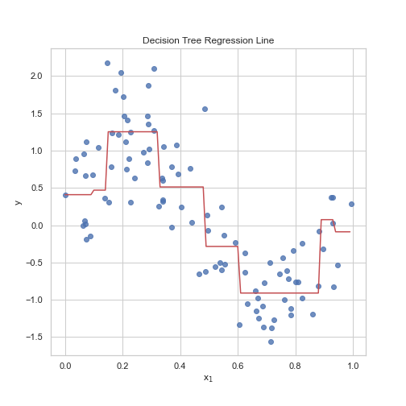

# Machine Learning

This repository contains basic (not necessarily optimal) pure numpy implementations of some machine learning algorithms.

<!-- Currently includes linear regression, logistic regression, nearest neighbors, support vector machines, principal components analysis, k-means clustering, decision trees, random forests and neural networks (fully-connected and convolutional layers). -->

<!-- ## Samples -->

##### [Linear Regression](src/linear_regression.py)


##### [KNN](src/knn.py)


##### [Support Vector Machines](src/svm.py)


##### [Principal Components Analysis](src/pca.py)


##### [K-Means Clustering](src/kmeans.py)


##### [Decision Trees](src/decision_tree.py)




##### [Random Forests](src/random_forest.py)


##### [Neural Networks](src/neural_networks)

```python
from neural_networks.neural_network import NeuralNetwork 
from neural_networks.losses import BinaryCrossEntropy 
from neural_networks.activations import ReLU, Sigmoid
from neural_networks.optimizers import SGD
from neural_networks.layers import FC

# generate data
m = 512
n = 2
X1 = np.concatenate([np.random.normal(-0.5,0.5,size=m//2),np.random.normal(0.5,0.5,size=m//2)],axis=0)
X2 = -np.concatenate([np.random.normal(2,2,size=m//2),np.random.normal(5,2,size=m//2)],axis=0)
X = np.concatenate([X1.reshape(m,1),X2.reshape(m,1)],axis=1)
X = X.transpose()
y = np.concatenate([np.ones(m//2),np.zeros(m//2)])

# create network
network = NeuralNetwork(loss=BinaryCrossEntropy(),optimizer=SGD(batch_size=8))
network.add_layer(FC(100,ReLU()))
network.add_layer(FC(100,ReLU()))
network.add_layer(FC(100,ReLU()))
network.add_layer(FC(1,Sigmoid()))

# fit network
n_epochs= 100
lr = 1e-3
network.fit(X,y,n_epochs,lr)

plot_decision_boundary_2d(network,X,y,t=True)
plt.title(f'Neural Network Decision Boundary - {n_epochs} Epochs, Learning Rate = {lr}')
plt.savefig('figures/nnclass');
```


