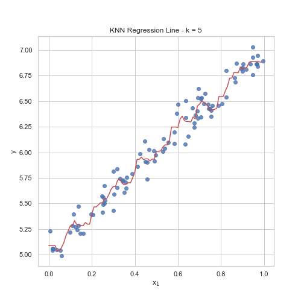

# Machine Learning

This repository contains basic (not necessarily optimal) pure numpy implementations of some machine learning algorithms. Currently includes linear regression, logistic regression, nearest neighbors, support vector machines, principal components analysis, k-means clustering, decision trees, random forests and neural networks (fully-connected and convolutional layers).

## Samples

#### Linear Regression

#### Nearest Neighbor Regression

#### Nearest Neighbor Classification

#### Support Vector Machines

#### K-Means Clustering

#### Decision Tree Regression

#### Decision Tree Classification

