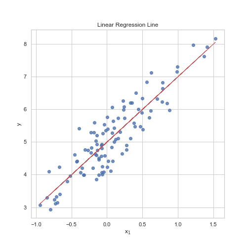
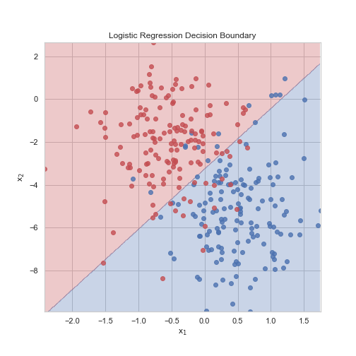
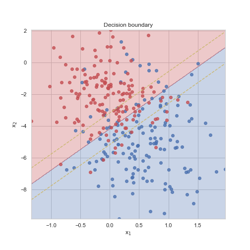
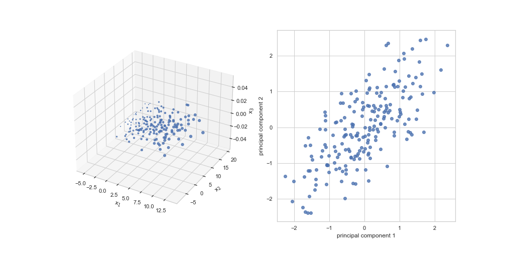

# Machine Learning

This repository contains pure numpy implementations of some machine learning algorithms (written for educational purposes).

## Contents
- [linear_regression](src/linear_regression.py): linear regression with ridge penalty
- [logistic_regression](src/logistic_regression.py): logistic regression with ridge penalty
- [knn](src/knn.py): k-nearest neighbors regression and classification
- [svm](src/svm.py): support vector machines classification
- [pca](src/pca.py): principal components analysis
- [kmeans](src/random_forest.py): k-means clustering
- [decision_tree](src/decision_tree.py): classification and regression decision trees
- [random_forest](src/random_forest.py): classification and regression random forests
- [neural_networks](src/neural_networks): multi-layer perceptrons and a basic SGD optimizer

## Figures
### Linear Regression

```python
from linear_regression import LinearRegression

# generate data
m = 100
n = 1
X = np.random.normal(0,0.5,(m,n))
y = 2*X[:,:] + 5 + np.random.normal(0,0.5,(m,1)) 

# fit linear regression model
lr = LinearRegression()
n_epochs = 200
lr = 0.1
lr.fit(X,y,lr,n_epochs)
y_pred = lr.predict(X)

# plot linear regression line
plt.figure(figsize=(7,7))
plt.scatter(X[:,0],y,alpha=0.8)
plt.plot(X[:,0],y_pred,color='r',linewidth=0.75)
plt.xlabel("x$_1$")
plt.ylabel("y")
plt.title('Linear Regression Line')
```

<!-- Given a feature matrix $X\in\mathbb{R}^{m\times (n+1)}$ and an output vector $y\in\mathbb{R}^{m}$, we assume a parameter vector $\theta\in\mathbb{R}^{n+1}$ associated with the linear model $h_{\theta}(x)$ defined as
$$
h_{\theta}(x) = \theta^Tx
$$
$x\in\mathbb{R}^{n+1}$. To find the optimal values of the parameter vector, we minimize a loss function $L(\theta)$ given by 
$$
L(\theta) = \frac{1}{m}||y-X\theta||_2^2 + \frac{1}{2m} \sum_{i=1}^{n}{\theta_i^2}= (y-X\theta)^T(y - X\theta) + \frac{1}{2m} \sum_{i=1}^{n}{\theta_i^2}
$$
To minimize this function, we compute the gradient vector $\frac{\partial L(\theta)}{\partial \theta}\in\mathbb{R}^{n+1}$ as
$$
\frac{\partial L(\theta)}{\partial \theta} = -\frac{1}{m}X^T(y-X\theta) + \frac{1}{m} \sum_{i=1}^{n}{\theta_i}
$$
Finally, we update the parameters over several iterations of gradient descent with the update
$$
\theta = \theta - \alpha\frac{\partial L(\theta)}{\partial \theta}
$$
where $\alpha$ is some learning rate. -->



<!-- Given a feature matrix $X\in\mathbb{R}^{m\times (n+1)}$ and an output vector $y\in\mathbb{R}^{m}$, we again assume a parameter vector $\theta\in\mathbb{R}^{(n+1)}$ associated with the model $h_{\theta}(x)$ defined as
$$
h_{\theta}(x) = \frac{1}{1+e^{-\theta^Tx}}
$$
$x\in\mathbb{R}^{n+1}$, where $h_{\theta}(x) = P(y=1|x;\theta)$. To find the optimal values of the parameter vector, we minimize a loss function $L(\theta)$ given by 
$$
L(\theta) = -\frac{1}{m}\sum_{i=1}^{m}{y_i\log{(h_{\theta}(X_i))}+(1-y_i)\log{(1-h_{\theta}(X_i))}} + \frac{1}{2m} \sum_{i=1}^{n}{\theta_i^2}
$$

To minimize this function, we compute the gradient vector $\frac{\partial L(\theta)}{\partial \theta}\in\mathbb{R}^{n+1}$ as
$$
\frac{\partial L(\theta)}{\partial \theta} = -\frac{1}{m}\sum_{i=1}^{m}{(y_i-h_{\theta}(X_i))X_i}+ \frac{1}{m} \sum_{i=1}^{n}{\theta_i}

$$
Finally, we update the parameters over several iterations of gradient descent with the update
$$
\theta = \theta - \alpha\frac{\partial L(\theta)}{\partial \theta}
$$
where $\alpha$ is some learning rate. -->

### Logistic Regression
```python
from logistic_regression import LogisticRegression

# generate data
m = 300
n = 2
X1 = np.concatenate([np.random.normal(-0.5,0.5,size=m//2),np.random.normal(0.5,0.5,size=m//2)],axis=0)
X2 = -np.concatenate([np.random.normal(2,2,size=m//2),np.random.normal(5,2,size=m//2)],axis=0)
X = np.concatenate([X1.reshape(m,1),X2.reshape(m,1)],axis=1)
y = np.concatenate([np.ones((m//2,1)),np.zeros((m//2,1))],axis=0)

# fit logisitic regression model
logreg = LogisticRegression(10)
n_epochs = 200
lr = 0.1
logreg.fit(X,y,lr,n_epochs)
y_pred = logreg.predict(X)
```


### K-Nearest Neighbors
```python
from knn import KNNRegression, KNNClassification

# generate data
m = 100
n = 1
X = np.random.rand(m,n)
y = 2*X[:,0] + 5 + np.random.normal(0,0.1,m)

# fit KNN model
k = 5
knn = KNNRegression(k=k)
knn.fit(X,y)

# plot KNN regression line
X_sweep = np.arange(0,1,0.01).reshape(-1,1)
y_sweep = knn.predict(X_sweep)
plt.figure(figsize=(7,7))
plt.scatter(X[:,0],y,alpha=0.8)
plt.plot(X_sweep,y_sweep,color='r')
plt.xlabel("x$_1$")
plt.ylabel("y")
plt.title(f'KNN Regression Line - k = {k}')
```


```python
# generate data
m = 300
n = 2
X1 = np.concatenate([np.random.normal(1,2,size=m//2),np.random.normal(4,3,size=m//2)],axis=0)
X2 = -np.concatenate([np.random.normal(2,2,size=m//2),np.random.normal(5,2,size=m//2)],axis=0)
X = np.concatenate([X1.reshape(m,1),X2.reshape(m,1)],axis=1)
y = np.concatenate([np.ones(m//2),np.zeros(m//2)])

# fit KNN model
k = 5
knn = KNNClassification(k=k)
knn.fit(X,y)

# plot KNN decision boundary
plot_decision_boundary_2d(knn,X,y,0.1)
plt.title(f'KNN Classification Decision Boundary - k = {k}')
```


### SVM
```python
from svm import SVM

# generate data
m = 300
n = 2
X1 = np.concatenate([np.random.normal(0,0.5,size=m//2),np.random.normal(0.5,0.5,size=m//2)],axis=0)
X2 = -np.concatenate([np.random.normal(2,2,size=m//2),np.random.normal(5,2,size=m//2)],axis=0)
X = np.concatenate([X1.reshape(m,1),X2.reshape(m,1)],axis=1)
y = np.concatenate([np.ones(m//2),np.zeros(m//2)])

# fit SVM model
C = 100
svm = SVM(kernel='linear',C=C)
svm.fit(X,y)

# plot SVM optimal seperating hyperplane
plt.figure(figsize=(7,7))
for yc, color in zip(np.unique(y),['b','r']):
    Xc=X[y==yc] 
    plt.scatter(x=Xc[:,0],y=Xc[:,1],c=color,alpha=0.8)
hyperplane_x1 = np.arange(np.min(X[:,0]),np.max(X[:,0]),0.1)
hyperplane_x2 = -(svm.w[0]*hyperplane_x1+svm.b)/svm.w[1]
plt.plot(hyperplane_x1,hyperplane_x2,color='r')
margin1_x2 = hyperplane_x2 + 1
margin2_x2 = hyperplane_x2 - 1
plt.plot(hyperplane_x1,margin1_x2,'--',color='y',linewidth=1.5)
plt.plot(hyperplane_x1,margin2_x2,'--',color='y',linewidth=1.5)
plt.title(f'Optimal seperating hyperplane, C={C}');
```



### Principal Components Analysis

```python
from pca import PCA

# generate data
m = 200
n = 3
X1 = np.random.normal(4,4,size=m)
X2 = np.random.normal(5,5,size=m)
X3 = 2*X1 + 3 + np.random.normal(0,1,size=m)
X = np.concatenate([X1.reshape(m,1),X2.reshape(m,1),X3.reshape(m,1)],axis=1)

# fit PCA model with 2 components
pca = PCA(k=2)
pca.fit(X)
y = pca.transform(X)

# plot original data
fig = plt.figure(figsize=(14,7))
ax = fig.add_subplot(1,2,1,projection='3d')
plt.scatter(X1,X2,X3,alpha=0.8)
ax.set_xlabel("x$_1$")
ax.set_ylabel("x$_2$")
ax.set_zlabel("x$_3$");
# plot PCA transformed data
ax = fig.add_subplot(1,2,2)
plt.scatter(y[:,0],y[:,1],alpha=0.8)
ax.set_xlabel("principal component 1")
ax.set_ylabel("principal component 2")
```



### K-Means Clustering

```python
from kmeans import KMeansClustering

# generate data
m = 500
X1 = np.concatenate([np.random.normal(1,1,m//2),np.random.normal(2.5,1,m//2),np.random.normal(4,1,m//2)]).reshape(-1,1)
X2 = np.concatenate([np.random.normal(2,1,m//2),np.random.normal(5,1,m//2),np.random.normal(2,1,m//2)]).reshape(-1,1)
X = np.concatenate([X1,X2],axis=1)

# fit kmeans model
kmeans = KMeansClustering(n_clusters=3)
n_itr = 10
for c, cluster_centroids in kmeans.fit(X,itr=n_itr):
    pass

# plot clusters and cluster centroids
plt.figure(figsize=(7,7))
hue = np.zeros(X.shape[0])
colors = ['r','g','b']
for j in range(len(cluster_centroids)):
    cluster_centroid = cluster_centroids[j]
    plt.plot(cluster_centroid[0],cluster_centroid[1],marker='o',color=colors[j],markersize=10,markeredgewidth=3,markeredgecolor='k')
    Xc=X[c==j]
    plt.scatter(x=Xc[:,0],y=Xc[:,1],color=colors[j],alpha=0.8);
plt.title(f'K-Means Clustering - {n_itr} iterations')
```


### Decision Trees

```python
from decision_tree import RegressionDecisionTree, ClassificationDecisionTree

# generate data
m = 100
n = 1
X = np.random.rand(m,n)
y = np.sin(2*np.pi*X[:,0]) + np.random.normal(0,0.5,m)

# fit regression tree model
tree = RegressionDecisionTree(max_depth=4,min_samples_split=5)
tree.fit(X,y)

# plot regression line
X_sweep = np.arange(0,1,0.01).reshape(-1,1)
y_sweep = tree.predict(X_sweep)
plt.figure(figsize=(7,7))
plt.scatter(X[:,0],y,alpha=0.8)
plt.plot(X_sweep,y_sweep,color='r')
plt.xlabel("x$_1$")
plt.ylabel("y")
plt.title(f'Decision Tree Regression Line')
```


```python
# generate data
m = 200
n = 2
X1 = np.concatenate([np.random.normal(-0.5,0.5,size=m//2),np.random.normal(0.5,0.5,size=m//2)],axis=0)
X2 = -np.concatenate([np.random.normal(2,2,size=m//2),np.random.normal(5,2,size=m//2)],axis=0)
X = np.concatenate([X1.reshape(m,1),X2.reshape(m,1)],axis=1)
y = np.concatenate([np.ones(m//2),np.zeros(m//2)])

# fit classification tree model
max_depth = 8
tree = ClassificationDecisionTree(max_depth=max_depth)
tree.fit(X,y)

# plot decision boundary
plot_decision_boundary_2d(tree,X,y)
plt.title(f'Decision Tree Decision Boundary - Max Depth = {max_depth}')

```


### Random Forests
```python

from random_forest import RandomForestClassification, RandomForestRegression

# generate data
m = 100
n = 1
X = np.random.rand(m,n)
y = np.sin(2*np.pi*X[:,0]) + np.random.normal(0,0.1,m)

# fit random forest model
max_depth = 6
n_trees = 100
min_samples_split = 5
forest = RandomForestRegression(n_trees=n_trees,max_depth=max_depth,min_samples_split=min_samples_split)
forest.fit(X,y)

# plot regression line
X_sweep = np.arange(0,1,0.01).reshape(-1,1)
y_sweep = forest.predict(X_sweep)
plt.figure(figsize=(7,7))
plt.scatter(X[:,0],y,alpha=0.8)
plt.plot(X_sweep,y_sweep,color='r')
plt.xlabel("x$_1$")
plt.ylabel("y")
plt.title(f'Random Forest Regression Line - {n_trees} Trees, Max Depth = {max_depth}, Min Samples Split = {min_samples_split}')
```


```python
m = 200
n = 2
X1 = np.concatenate([np.random.normal(-0.5,0.5,size=m//2),np.random.normal(0.5,0.5,size=m//2)],axis=0)
X2 = -np.concatenate([np.random.normal(2,2,size=m//2),np.random.normal(5,2,size=m//2)],axis=0)
X = np.concatenate([X1.reshape(m,1),X2.reshape(m,1)],axis=1)
y = np.concatenate([np.ones(m//2),np.zeros(m//2)])

max_depth = 6
n_trees = 100
forest = RandomForestClassification(n_trees=n_trees,max_depth=max_depth,max_features=2)
forest.fit(X,y)

plot_decision_boundary_2d(forest,X,y)
plt.title(f'Random Forest Decision Boundary - {n_trees} Trees, Max Depth = {max_depth}')
plt.savefig('figures/forestclass')
```


### Feedforward Neural Network

```python
from neural_networks.neural_network import NeuralNetwork 
from neural_networks.losses import BinaryCrossEntropy 
from neural_networks.activations import ReLU, Sigmoid
from neural_networks.optimizers import SGD
from neural_networks.layers import FC

# generate data
m = 512
n = 2
X1 = np.concatenate([np.random.normal(-0.5,0.5,size=m//2),np.random.normal(0.5,0.5,size=m//2)],axis=0)
X2 = -np.concatenate([np.random.normal(2,2,size=m//2),np.random.normal(5,2,size=m//2)],axis=0)
X = np.concatenate([X1.reshape(m,1),X2.reshape(m,1)],axis=1)
X = X.transpose()
y = np.concatenate([np.ones(m//2),np.zeros(m//2)])

# create network
network = NeuralNetwork(loss=BinaryCrossEntropy(),optimizer=SGD(batch_size=8))
network.add_layer(FC(100,ReLU()))
network.add_layer(FC(100,ReLU()))
network.add_layer(FC(100,ReLU()))
network.add_layer(FC(1,Sigmoid()))

# fit network
n_epochs= 100
lr = 1e-3
network.fit(X,y,n_epochs,lr)

plot_decision_boundary_2d(network,X,y,t=True)
plt.title(f'Neural Network Decision Boundary - {n_epochs} Epochs, Learning Rate = {lr}')
```


